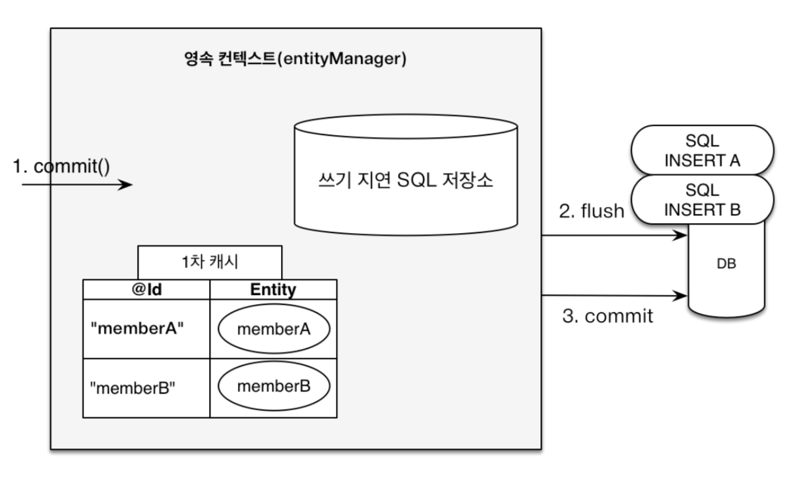

- JPA란?

  # JPA

  데이터 베이스의 데이터와 객체를 연결해서 쿼리 작성 대신 객체를 이용해서 데이터를 관리하게 하는 ORM 기술을 사용하는 인터페이스의 모음

  → 인터페이스이므로 Hibernate, EclipseLink 등 구현체를 이용해서 사용

  ## ORM vs **SQL Mapper(JdbcTemplate, Mybatis)**

    - ORM
        - db 테이블과 클래스를 매핑 → SQL문을 개발자가 직접 작성하지 않고 코드로 db를 조작
        - 장점
            - 객체만 매핑하면 쿼리문을 짜주고 jdbc 사용하는 반복적인 일을 대신 해주기 때문에 **생산성이 향상**됨
            - 새로운 칼럼을 추가할 때 필드 하나만 추가하면 됨 → **유지보수 줄어듦**
    - SQL Mapper
        - 쿼리문을 직접 작성해서 DB를 조작
        - 장점
            - sql을 마음대로 작성 → 복잡한 쿼리도 자유롭게 작성 가능
            - 작성한 대로 sql이 나가기 때문에 어떤 쿼리가 나가는지 명확하고 성능 튜닝이 쉬움
                - n+1 문제, 예상하지 못한 쿼리가 생기는 일 없음
            - sql 알기만 하면 바로 사용 가능
        - 단점
            - orm의 장점의 반대가 전부 단점

  ## JPA 사용 시 주의점

  jpa는 **영속성 컨텍스트**를 이용해서 데이터를 관리하기 때문에 성능 최적화

  

  하지만 영속성 컨텍스트를 잘 이해하지 못하고 사용하면 성능 저하가 발생할 가능성이 높다!

    - n+1 문제
    - entity를 직접 api 응답으로 반환 시 stackoverflow 발생 가능
        - 양방향 연관관계를 가진 엔티티를 json으로 변환 시도한다면 서로 끊임없이 호출하다가 에러남
        - 이래서 DTO를 사용
    - 즉시로딩 사용의 문제점
    - 무의미한 save() 호출
        - jpa는 내부에서 Dirty Checking을 통해 변경을 감지하고 트랜잭션이 끝나면 update를 날리므로 데이터 수정 후 save() 호출할 필요가 없음
- N+1 문제란?

  # N+1 문제

  orm 기술에서 특정 객체를 대상으로 수행한 쿼리가 그 객체의 연관 관계에 있는 n개의 객체들도 조회하게 되어서 n번의 추가적인 쿼리가 발생하게 되는 문제

  ## 예시

  식당과 메뉴 엔티티가 1:N 관계일 때 식당 엔티티가 5개가 있다고 가정
  이 때 5개의 식당 정보를 알려고 할 때 코드를 작성하고 실제 실행 되는 쿼리는

    ```sql
    SELECT * FROM restaurant;
    
    SELECT * FROM menu WHERE restaurant_id = 1;
    SELECT * FROM menu WHERE restaurant_id = 2;
    ...
    ```

  이렇게 N번의 쿼리가 더 실행되게 됨

  이러면 후에 데이터가 많아졌을 때 장애 요인이 됨

  ## 원인

  식당 엔티티를 조회할 때 테이블을 객체로 맵핑하기 위해 먼저 식당 테이블을 가져오는 쿼리를 날리고 추가로 메뉴 테이블을 조회하는 쿼리를 날려서 식당 테이블을 완성하는 방식으로 작동하기 때문!

  ## 해결 방법

  ## **1. outer join fetching**

  ### 1.1 **fetch join**

    ```sql
    public interface RestaurantRepository extends JpaRepository<Restaurant, Long> {
    
        @Query("select t from restaurant r join fetch r.menu")
        List<Team> findAllWithInnerFetchJoin();
        
        @Query("select t from restaurant r left join fetch r.menu")
        List<Team> findAllWithOuterFetchJoin();
    }
    ```

  → 모든 식당 데이터를 가져올 때 메뉴도 join해서 가져와서 실제 실행되는 쿼리의 개수가 1개

  ### 1.2 EntityGraph

    ```sql
    public interface RestaurantRepository extends JpaRepository<Restaurant, Long> {
    
        @Query("SELECT r FROM restaurant r")
        @EntityGraph(attributePaths = "menu")
        List<Restaurant> findAllWithEntityGraph();
    }
    ```

  → 실제로 실행되는 쿼리는 menu를 left join fetch해서 restaurant 엔티티를 가져오는 쿼리기 때문에 쿼리가 1번만 실행

  ## 2.  **batch fetching**

    ```sql
    @Entity
    public class Restaurant{
    
        ...
    
        @OneToMany(mappedBy = "restaurant", fetch = FetchType.EAGER)
        @BatchSize(size = 5)
        private List<Menu> menu = new ArrayList<>();
    	
        ...
    }
    
    ```

  조회되는 엔티티 위에 @BatchSize를 추가하고 Menu 엔티티가 조회될 때 IN 절을 통해 한번에 조회

  → n번의 조회를 1번으로 줄이는 방식

  ## 3. **subselect fetching**

    ```sql
    @Entity
    public class Restaurant{
    
        ...
    
        @OneToMany(mappedBy = "restaurant", fetch = FetchType.EAGER)
         @Fetch(value = FetchMode.SUBSELECT)
        private List<Menu> menu = new ArrayList<>();
    	
        ...
    }
    
    ```

  Menu 엔티티가 조회될 때 IN절과 서브 쿼리를 사용하여 한번에 조회

  → n번의 조회를 1번으로 줄이는 방식

  **batch & subselect fetching의 공통점**

    - LAZY하게 동작하기 때문에 LAZY 로딩에서 선언하기만 하면 상황을 고려할 필요가 없어서 편리
    - 그러나 fetch join을 권장
        - 편하지만 상황에 따라 쿼리가 달라지는 문제점 존재
- 지연로딩과 즉시로딩의 차이는?

  ## 지연로딩

  연관 관계 지정할 때 `(fetch = FetchType.LAZY)` 을 통해 지연 로딩으로 설정

    - 한 엔티티를 조회할 때 해당 엔티티와 연관 관계인 엔티티는 프록시에서 가지고 온다
    - 연관된 엔티티는 그 실제 데이터에 접근할 때에야 직접 db에 접근해서 값을 가지고 옴

  ## 즉시로딩

  연관 관계를 지정할 때 `(fetch = FetchType.EAGER)` 를 통해 즉시 로딩으로 설정 가능

    - 한 엔티티를 조회할 때 해당 엔티티와 연관관계인 엔티티를 모두 데이터베이스에서함께 불러와서 조회한다
    - 연관된 데이터가 항상 필요한 경우 유용하지만, 불필요한 데이터까지 조회할 수 있어 성능 저하의 원인이 될 수 있음

  둘 다 n+1 문제가 발생할 수 있으나 지연로딩은 제어 가능하고 즉시 로딩은 제어가 불가능하다 따라서

  **실무에서는 기본적으로 지연 로딩을 사용하고 두 가지 엔티티의 정보가 한 번에 필요한 기능에서는 fetch join을 사용해 처리한다**

- JPQL란?

  # JPQL

  jpa의 일부로 sql처럼 데이터 베이스를 다루는 언어지만 대상이 테이블이 아닌 객체를 대상으로 데이터를 조작하는 언어

  ## 특징

    - sql과 문법이 유사하며 SELECT, INSERT, FROM, WHERE, GROUP BY, HAVING, JOIN을 지원함
    - 특정데이터베이스 SQL에 의존하지 않음
    - 마지막에는 sql로 변환되어서 작동한다
    - 별칭 사용은 필수적
    - 테이블 이름이 아닌 엔티티 이름을 사용
    - 주의할 점
        - 기본 문자열로 작성되어서 문제가 있어도 발견 어려움

  ## 사용

  ### **EntityManager 인터페이스**

    ```java
    @PersistenceContext
    private EntityManager em; //주입
    ```

    - 모든 결과의 목록을 알고싶을 때 : getResultList()
        - 결과가 없으면 빈 리스트 반환

    ```java
    public List<Cafeteria> findAllCafeterias() {
        // 1. JPQL 작성 (테이블이 아니라 'Cafeteria' 엔티티 객체를 대상으로 쿼리)
        String jpql = "SELECT c FROM Cafeteria c"; 
        
        // 2. 쿼리 생성 및 실행
        return em.createQuery(jpql, Cafeteria.class)
                 .getResultList(); // 결과가 여러 개(List)일 때 사용
    }
    ```

    - 하나의 결과 : getSingleResult()
        - 결과가 없거나 2개 이상이면 예외 발생
    - 특정 조건으로 검색 (파라미터 바인딩): setParameter()

        ```java
        public Cafeteria findCafeteriaByName(String searchName) {
            String jpql = "SELECT c FROM Cafeteria c WHERE c.name = **:name**"; // :name 이 파라미터 자리
            
            return em.createQuery(jpql, Cafeteria.class)
                     **.setParameter("name", searchName)** // :name 자리에 searchName 변수 값을 바인딩
                     .getSingleResult(); // 결과가 정확히 1개일 때 사용
        }
        ```

    - 하나의 쿼리를 사용하여 다수의 데이터를 변경 (벌크 연산): executeUpdate()

        ```java
        public int updateAllMealsPrice(int increaseAmount) {
            String jpql = "UPDATE Meal m SET m.price = m.price + :amount";
            
            return em.createQuery(jpql)
                     .setParameter("amount", increaseAmount)
                     .executeUpdate(); // 영향을 받은(수정/삭제된) 데이터의 개수를 반환합니다.
        }
        ```


- Fetch Join란?

  # Fetch Join

  JPA에서 엔티티를 조회할 때 연관된 엔티티를 처음부터 함께 로딩하는 방식

    ```sql
    public interface RestaurantRepository extends JpaRepository<Restaurant, Long> {
    
        @Query("select t from restaurant r **join fetch** r.menu")
        List<Team> findAllWithInnerFetchJoin();
        
        @Query("select t from restaurant r left **join fetch** r.menu")
        List<Team> findAllWithOuterFetchJoin();
    }
    ```

    - 특징
        - 위에 나왔던 n+1 문제를 해결하기 위해 사용
        - sql의 조인의 종류가 아니라 jpql에서 성능 최적화를 위해 제공하는 기능
        - 다음과 같이 동작한다.
            - JPQL
                - `SELECT m FROM Member m JOIN FETCH m.team`
            - SQL
                - `SELECT m.*, t.* FROM Member m INNER JOIN Team t ON m.team_id=t.id`
    - 일반 join과 fetch join의 차이
        - 일반 Join
            - Fetch Join과 달리 연관 Entity에 Join을 걸어도 실제 쿼리에서 SELECT 하는 Entity는오직 JPQL에서 조회하는 주체가 되는 Entity만 조회하여 영속화
            - 조회의 주체가 되는 Entity만 SELECT 해서 영속화하기 때문에 데이터는 필요하지 않지만 연관 Entity가 검색조건에는 필요한 경우에 주로 사용
        - fetch join
            - 조회의 주체가 되는 Entity 이외에 Fetch Join이 걸린 연관 Entity도 함께 SELECT 하여 모두 영속화
            - Fetch Join은 연관 엔티티를 한 번의 JOIN 쿼리로 함께 조회해 영속성 컨텍스트에 미리 로딩하므로, 지연로딩이어도 추가 쿼리가 발생하지 않아 N+1 문제가 발생하지 않음
- @EntityGraph란?

  # EntityGraph

  엔티티를 조회할 때 연관된 엔티티를 어떤 방식으로 가져올지 정의하는 방법

  ## 사용 이유

    - N+1 문제 해결
    - JPQL 대체
        - 복잡한 jpql 사용하지 않고 연관 데이터 가져올 수 있음
    - 선택적 로딩
        - 필요에 따라 연관된 특정 데이터만 가져올 수 있어서 성능 최적화 가능

  ## 사용 예시

    ```java
    //공통 메서드 오버라이드
    @Override
    @EntityGraph(attributePaths = {"team"}) 
    List<Member> findAll();
    
    //JPQL + 엔티티 그래프 
    @EntityGraph(attributePaths = {"team"}) 
    @Query("select m from Member m") 
    List<Member> findMemberEntityGraph();
    
    //메서드 이름으로 쿼리
    @EntityGraph(attributePaths = {"team"})
    List<Member> findByUsername(String username)
    ```

    - 이렇게 하면 JPQL 없이 페치 조인을 사용할 수 있다
    - left outer join을 사용해서 fetch join을 하는 방식
- commit과 flush 차이점은?

  ## 공통점

    - 영속성 컨텍스트에서의 변경 사항을 데이터베이스와 동기화하는 과정에 관여

  ## 차이점

  ### flush

    - 영속성 컨텍스트의 변경사항을 **즉시 데이터베이스에 반영**
        - 1차 캐시나 영속성 컨텍스트 안에 있는 엔티티들은 그대로 유지
        - 비우는 역할은 clear()
    - 해당 트랜잭션을 바로 커밋하지 않음
        - ROLLBACK을 사용해서 데이터베이스를 반영 전으로 되돌리기 가능
    - 자동 실행 시점
        - 트랜잭션 커밋 시 (commit 내부 동작)
        - JPQL 쿼리 실행 시
    - 사용 목적
        - 변경 사항을 즉시 데이터베이스에 반영해야 하지만 트랜잭션은 유지해야 할 때 사용
        - JPQL 실행 전에 변경 사항을 강제 반영해야 할 때 사용

  ### commit

    - 현재 트랜잭션을 완료하고 모든 변경 사항을 확정
    - 내부적으로 **flush 실행 후 바로 트랜잭션을 커밋**하는 과정
    - 이후 rollback(트랜잭션 취소할 때 사용) 불가
    - 다른 트랜잭션에서도 변경 사항을 볼 수 있게함
        - flush를 통해 DB에 쿼리가 전송되어 데이터가 조작되었더라도, commit이 발생하기 전까지는 다른 DB 커넥션이나 다른 트랜잭션에게는 그 변경된 데이터가 보이지 않음