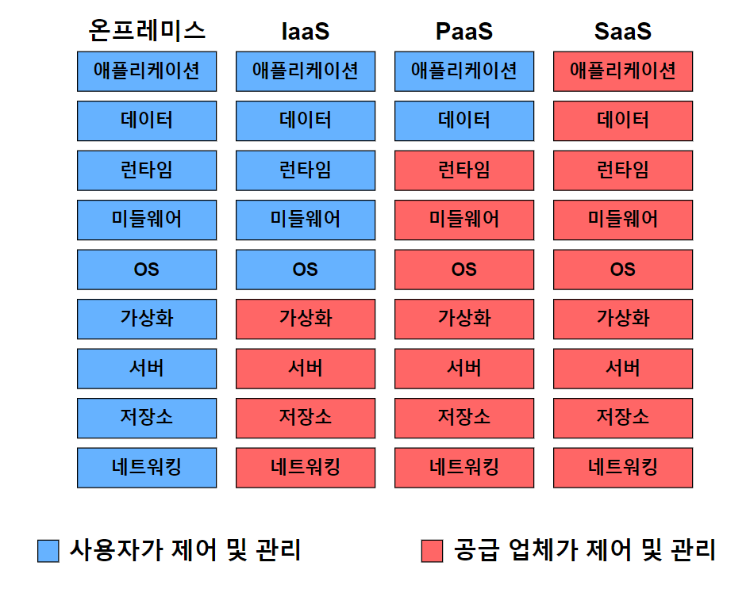

- 클라우드 컴퓨팅이란?

  ## 클라우드 컴퓨팅

  클라우드 컴퓨팅이란 인터넷을 통해 IT 인프라같은 컴퓨팅 자원들을 빌려서 사용하는 방식이다

    - 사용하는 이유
        - 초기 비용 절감 : 서버, 네트워크 장비 등 하드웨어를 직접 구매할 필요가 없고 사용한 만큼 비용을 지불하는 방식이라 초기 비용이 거의 들어가지 않는다
        - 확장성과 탄력성 : 트래픽 증가/감소에 따라 서버 자원을 자동으로 늘리거나 줄일 수 있어 갑작스러운 트래픽 스파이크에도 대응 가능하다
        - 고가용성 : 클라우드 서비스는 여러 리전을 가지고 있고 또 한 리전 안에서 여러 가용 영역에 배치( Multi-AZ )할 수 있어, 한 가용 영역에 장애가 발생해도 다른 곳으로 옮겨가기 때문에 서비스가 지속될 수 있다
        - 보안 : 대형 클라우드 업체는 자체적으로 막대한 보안 인프라와 인증을 갖추고 있어 개별 기업이 직접 구축하기 어려운 수준의 보안을 활용할 수 있다
    - 종류

      

        - IaaS
            - IT 인프라만을 가상화하여 제공하는 클라우드 서비스 모델
            - AWS EC2, Microsoft Azure Virtual Machines
        - PaaS
            - 애플리케이션 개발 및 배포를 위한 플랫폼을 제공하는 클라우드 서비스 모델
            - GitHub Actions & GitLab CI/CD
        - Saas
            - 웹을 통해 소프트웨어를 이용할 수 있도록 제공하는 클라우드 서비스 모델
            - Google Drive, Dropbox, OTT, Slack
- AWS? GCP?

  ## Amazon Web Services(AWS)

  아마존에서 제공하는 클라우드 컴퓨팅 서비스, 전 세계 클라우드 시장에서 가장 높은 점유율을 가지고 있다

  ## Google Cloud Platform(GCP)

  구글에서 제공하는 클라우드 컴퓨팅 서비스, aws와 azure에 이어서 세 번 째로 큰 시장 점유율을 차지하고 있음

  |  | **AWS(Amazon Web Services)** | **GCP(Google Cloud Platform)** |
      | --- | --- | --- |
  | **서비스 범위** | 다양한 서비스 제공(컴퓨팅, 스토리지, 데이터베이스, AI, IoT 등) | 빅데이터와 AI에 강점을 둔 다양한 서비스 제공 |
  | **강점** | 가장 많은 고객과 사용 사례 보유
  폭넓은 서비스 범위 및 기능           
  강력한 인프라 지원 | 뛰어난 데이터 분석 및 머신러닝 서비스
  구글의 기술 및 네트워크 인프라 활용
  비교적 저렴하고 유연한 가격 정책 |
  | **약점** | 복잡한 가격 정책
  가파른 학습 곡선(어떤 서비스를 써야 하는지 파악하기 어렵고, IAM 정책이 세밀해 잘 못 설정하면 보안 이슈 발생) | AWS에 비해 상대적으로 서비스 범위가 제한적
  따라서 일부 지역에서는 AWS보다 인프라가 적을 수 있음 |
- 환경변수 처리 방법과 왜 환경변수로 민감 정보를 가려야 하는가?

  ## **환경변수로 민감정보를 가리는 이유**

  소스코드에 DB 비밀번호, API 키, JWT secret key 같은 걸 직접 적어두면

    1. GitHub에 public repo로 올리면 봇들이 스캔해서 탈취 → db 중요 데이터가 전부 날아가거나 서버 인프라 접근 키가 털렸다면 해커들이 엄청난 사양의 서버를 수백 개씩 생성해서 서버비 요금 폭탄을 맞을 수도 있음
    2.  로컬/개발/운영 환경마다 DB 주소나 키가 다른데, 코드에 박아두면 환경 바뀔 때마다 코드를 수정/재배포해야 함

  ## 환경 변수 처리 방법

    1. application.yml에 플레이스홀더만 쓰고 실제 값은 환경변수에서 주입

    ```yaml
    spring:
      datasource:
        url: ${DB_URL}
        username: ${DB_USERNAME}
        password: ${DB_PASSWORD}
    jwt:
      secret: ${JWT_SECRET}
    ```

    1. 로컬 개발 시에는 .env 파일에 값을 넣고 **.gitignore에 .env등을 반드시 추가**해서 커밋에서 제외되게 하기
    2. 실제 운영 배포 시에는 **서버 자체 환경변수**로 export 하는게 안전→ export JWT_SECRET=xxx
- yml 환경 분리 방법

  **YAML(yml)**

  스프링에서는 환경 변수, 데이터 소스 등 프로그램이 돌아갈 때 필요한 정보들을 보관할 수 있도록 application.properties 또는 application.yaml을 지원한다 그러나 로컬/개발/운영 환경에서 이들의 값들이 계속 달라지는데 이런 환경에서 매번 코드에서 값을 바꾸면 번거로울 것이다!

  → yml 환경 분리가 필요

    1. yaml 파일을 여러 파일 만들어서 쪼개기

    ```yaml
    application.yml          ← 공통 설정 + 활성 프로필 지정
    application-local.yml    ← 로컬 개발용
    application-dev.yml      ← 개발 서버용
    application-prod.yml     ← 운영 서버용
    ```

    ```yaml
    #application.yml
    
    spring:
      profiles:
        active: local   # 기본값, 실행 시 옵션으로 덮어쓸 수 있음
    
    # 모든 환경에서 공통으로 쓰는 설정
    server:
      port: 8080
    ```

    ```yaml
    # application-local.yml
    spring:
      datasource:
        url: jdbc:mysql://localhost:3306/mydb
        username: root
        password: 1234
    
    # application-prod.yml
    spring:
      datasource:
        url: ${DB_URL}
        username: ${DB_USERNAME}
        password: ${DB_PASSWORD}
    ```

    1. 한 파일에 ---로 구분하는 방식

    ```yaml
    spring:
      profiles:
        active: local
    ---
    spring:
      config:
        activate:
          on-profile: local
      datasource:
        url: jdbc:mysql://localhost:3306/mydb
    ---
    spring:
      config:
        activate:
          on-profile: prod
      datasource:
        url: ${DB_URL}
        password: ${DB_PASSWORD}
    ```

  ### 우선 순위 예시

    ```yaml
    #application-prod.yml
    spring:
      datasource:
        password: ${DB_PASSWORD}
    ```

    ```yaml
    java -jar app.jar **--spring.profiles.active=prod** **--spring.datasource.password=override_value**
    ```

    1. 커맨드라인 옵션 (-spring.profiles.active=prod)이 제일 강함 → password는 **override_value**
    2. 명령줄 옵션이 없으면 그 다음 설정해 놓은 환경변수
    3. 설정한 환경변수가 없으면 application-{profile}.yml (기본으로 설정해 놓은 파일에 적혀있는 password의 값)
    4. 그 다음은 application.yml (공통 파일)
- Docker와 .jar vs Docker 이미지

  ## Docker

  애플리케이션을 OS, JDK, 라이브러리까지 통째로 **이미지**라는 단위로 패키징해서, 어디서 실행하든 동일하게 동작하도록 만들어주는 컨테이너 기술. "내 컴퓨터에선 됐는데 서버에서는 안 됨" 문제를 근본적으로 줄여준다

  **Dockerfile 작성 및 빌드**

    ```bash
    docker build -t myapp .
    docker run -e SPRING_PROFILES_ACTIVE=prod -e DB_PASSWORD=xxx myapp
    ```

  -e 옵션으로 환경변수를 컨테이너에 주입하는 방식이 표준화되어 있어서, yml의 ${DB_PASSWORD} 같은 참조 값도 그대로 채워줄 수 있음

  ## . jar 직접 실행 vs Docker 이미지

  | 구분 | .jar 직접 실행 | Docker 이미지 |
      | --- | --- | --- |
  | 환경 의존성 | 서버에 설치된 Java/OS 환경에 의존 | 이미지 안에 환경 전체 포함, 독립적 |
  | 확장(스케일링) | 수동, 서버마다 직접 설정 필요 | 자동화 쉬움 |
  | 배포 단순성 | 매우 간단 (jar만 올리면 끝) | Dockerfile 작성/이미지 빌드 필요 |
  | 환경변수 주입 | --spring.profiles.active=xxx 직접 지정 | docker run -e 또는 docker-compose.yml로 표준화 |
  | 적합한 상황 | 토이 프로젝트, 단일 서버, 빠른 테스트 | 운영 서비스, 다중 서버, MSA |

  ## Docker의 장점

    - **환경 일관성**: 로컬에서 빌드한 이미지를 운영 서버에 그대로 올려도 동일하게 동작
    - **격리성**: 컨테이너 하나가 죽어도 다른 컨테이너/서버에 영향 없음
    - **확장성**: Kubernetes(EKS/GKE) 등 오케스트레이션 도구로 여러 인스턴스를 쉽게 추가/제거 가능
    - **환경변수 관리 표준화**: e 옵션이나 environment: 설정으로 일관되게 주입

  ## Docker의 단점

    - Docker 자체의 학습 곡선 존재
    - 컨테이너 레이어가 추가되어 디버깅이 한 단계 더 복잡해짐