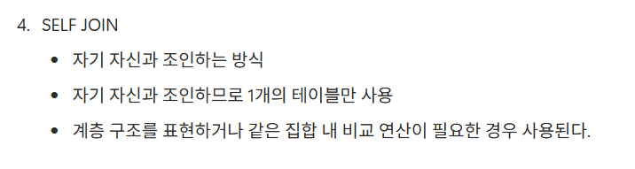

### 피어리뷰 (Spring A팀 레오)

### 워크북 리뷰

### 워크북 리뷰
<aside>
🌟

조인의 종류 중에서 self join 이라는 것이 있는지 몰랐어서 키워드 정리에 작성하지 못했는데 레오의 워크북을 보고 내가 몰랐던 부분을 알 수 있어서 좋았습니다

</aside>

###리뷰 작성하는 쿼리

쿼리문

<aside>

데이터 값들을 받아서 review 테이블에 insert로 넣어준다

INSERT INTO review ( content, rate, created_at, user_id, shop_id) VALUES (’음 너무 맛있어요…’, 5, now(), 1, 1);

</aside>

###마이 페이지 화면 쿼리

쿼리문

<aside>

사용자의 이름, 메일, 전화번호, 포인트의 정보가 필요하므로 그 데이터를 유저 테이블에서 가지고 온다

휴대폰 번호가 null인 경우 미인증 상태인 것이다

SELECT name, mail, phone_number, point

FROM user
WHERE id = 1;

</aside>

###내가 진행중, 진행 완료한 미션 모아서 보는 쿼리(페이징 포함)

쿼리문

<aside>

가게이름, 성공 여부, 조건 금액, 제공 포인트, 성공 여부가 필요하므로 미션 테이블, 가게 테이블, 사용자 미션 테이블들을 join해서 데이터를 가져와야 한다

SELECT s. id, s.name, m.content, m.point, um.is_completed

FROM mission m

JOIN user_mission um ON [m.id](http://m.id) = [um.mission_id](http://um.id)

JOIN shop s ON m.shop_id = [s.id](http://s.id)

WHERE um.user_id = 1 AND um.state = ‘complete’ AND um.id<90

ORDER BY u[m.id](http://m.id) desc
LIMIT 10;

마지막으로 조회한 um.id가 90일때 그걸 커서로 두고 커서 기반 페이징함
그리고 가게 id는 리뷰 작성할 때 맞는 가게로 찾아 가기 위해 가지고 옴

</aside>

###홈 화면 쿼리
(현재 선택 된 지역에서 도전이 가능한 미션 목록, 페이징 포함)

쿼리문

<aside>

사용자의 미션 중에서 달성한 미션의 개수 → count를 사용해서 user_mission 테이블에서 성공한 미션의 개수를 센다
지역, 가게 이름, 가게 유형, 조건 금액, 제공 포인트, 종료 날짜가 필요 → 지역 테이블, 사용자 미션 테이블, 미션 테이블, 가게 테이블을 JOIN해서 아직 성공 전인 미션 관련 데이터를 가지고 온다

<<사용자 달성 미션 개수>>

SELECT count(*)

FROM user_mission um

JOIN mission m ON um.mission_id = m.id

JOIN shop s ON m.shop_id = s.id
JOIN region r ON s.region_id = r.id

WHERE user_id=1 AND is_completed=true AND [r.name](http://r.name) = ‘안암동’

지역 데이터를 포함하기 위해서 shop 테이블도 조인

<<MY MISSION>>

SELECT s.id, s.name, s.category, m.content, m.point, m.due_date
FROM mission m
JOIN user_mission um ON [m.id](http://m.id) = um.mission_id
JOIN shop s ON m.shop_id = s.id
WHERE um.user_id = 1 AND um.is_completed = false AND um.id<90
ORDER BY u[m.id](http://m.id) desc
LIMIT 10;

커서 기반 페이징

</aside>