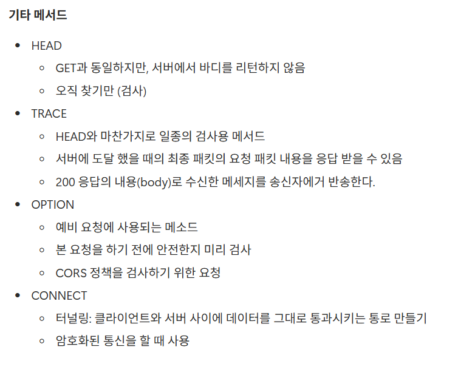

### 피어리뷰 (Spring A팀 레오)

## 워크북 리뷰


<aside>
🌟

잘 몰랐었고 미처 찾지 못했던 기타 메서드들을 구체적으로 조사하여 적은 것이 인상적이었다 나도 나중에 이 내용을 보충해서 공부해야겠다

</aside>

### 미션 기록

- 홈 화면 조회

    <aside>

  ### API Endpoint
    
  ---

  GET /v1/home/{user-id}

  ### Request Header
    
  ---

  Authorization : Bearer {accessToken}

  ### Request Body
    
  ---

    ```json
    ❌
    ```

  ### Query Parameter
    
  ---

    - region = 안암동

  ### Path Variable
    
  ---

    - {user-id}

  ### Reponse Body
    
  ---

    ```json
    안암동에서 달성한 미션의 개수와 유저가 시작전인 미션들의
    가게 이름, 가게 종류, 마감 기한, 조건 금액, 적립 포인트가 
    포함된 json 형식의 data
    ```

    </aside>


- 보유 포인트 조회

    <aside>

  ### API Endpoint
    
  ---

  GET /v1/points/{user-id}

  ### Request Header
    
  ---

  Authorization : Bearer {accessToken}

  ### Request Body
    
  ---

    ```json
    ❌
    ```

  ### Query Parameter
    
  ---

    - ❌

  ### Path Variable
    
  ---

    - {user-id}

  ### Reponse Body
    
  ---

    ```json
    유저가 현재 보유한 포인트
    ```

    </aside>


- 리뷰 작성

    <aside>

  ### API Endpoint
    
  ---

  POST /v1/missions/{mission-id}/review/{user-id}

  ### Request Header
    
  ---

  Authorization : Bearer {accessToken}

  ### Request Body
    
  ---

    ```json
    {
      "rate": 5,
      "content": "맛나요",
      "imageUrls": [
        "url1",
        "url2"
      ]
    }
    ```

  ### Query Parameter
    
  ---

    - ❌

  ### Path Variable
    
  ---

    - {mission-id}
    - {user-id}

  ### Reponse Body
    
  ---

    ```json
    리뷰 작성이 성공했다는 메세지와 리뷰의 정보
    ```

    </aside>


- 미션 목록 조회(진행 중, 진행 완료)

    <aside>

  ### API Endpoint
    
  ---

  GET /v1/missions/{user-id}

  ### Request Header
    
  ---

  Authorization : Bearer {accessToken}

  ### Request Body
    
  ---

    ```json
    ❌
    ```

  ### Query Parameter
    
  ---

    - is_completed=false
        - 진행 중
    - is_completed=true
        - 진행 완료

  ### Path Variable
    
  ---

    - {user-id}

  ### Reponse Body
    
  ---

    ```json
    진행 중/진행 완료한 미션들의 정보 
    ```

    </aside>


- 미션 성공 누르기

    <aside>

  ### API Endpoint
    
  ---

  PATCH /v1/missions/{mission-id}/{user-id}

  ### Request Header
    
  ---

  Authorization : Bearer {accessToken}

  ### Request Body
    
  ---

    ```json
    
    ```

  ### Query Parameter
    
  ---

  ❌

  ### Path Variable
    
  ---

    - {user-id}
    - {mission-id}

  ### Reponse Body
    
  ---

    ```json
    요청이 성공했다는 메세지와 성공한 미션의 정보
    ```

    </aside>


- 회원 가입

    <aside>

  ### API Endpoint
    
  ---

  POST /v1/user

  ### Request Header
    
  ---

  ❌

  ### Request Body
    
  ---

    ```json
    {
    	"agreedTermsIds":[ 1, 2, 3, 5 ],
    	"name":"오수빈",
    	"gender":"FEMALE",
    	"birth":"2006-11-11",
    	"adress":"인천",
    	"user_food":["1", "5"]
    }
    ```

  ### Query Parameter
    
  ---

  ❌

  ### Path Variable
    
  ---

  ❌

  ### Reponse Body
    
  ---

    ```json
    회원가입이 성공했다는 메세지와 유저의 정보
    ```

    </aside>