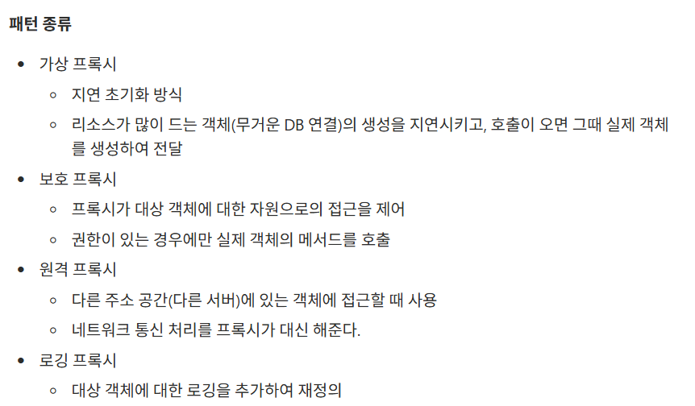

### 워크북 캡쳐

### 워크북 리뷰

<aside>
🌟

나는 프록시의 개념밖에 조사하지 못했는데 구체적으로 프록시의 종류에 대해서 조사하신 것이 좋았다

</aside>

- **미션 기록**

  ### 스프링의 요청 및 응답 흐름 (Spring MVC 흐름)

  **<스프링이 요청 받기 전 준비>**

  일단 스프링 부트 애플리케이션이 실행되면 메인 클래스가 실행된다

  이때 스프링은 컴포넌트 스캔을 수행해 @Componet, @Service 같은 어노테이션이 붙은 클래스를 찾고 이를 빈으로 생성해 등록한다

  이후 각 빈이 필요로 하는 다른 빈들도 확인해서 의존성을 연결한다

  즉 요청이 오기 전에 의존 관계를 파악하고 실행 준비를 미리 해두는 것

  **<요청 흐름>**

    1. 사용자가 어떤 행위를 통해서 HTTP 요청을 서버로 보낸다
    2. 요청은 Filter를 통과해 공통적으로 처리해야할 단계를 거친다 (필수적 단계는 아님)
        1. 주로 로그 남기기, 요청 인코딩 설정 등 같은 일을 한다
    3. DispatcherServlet이 요청을 받는다
    4. DispatcherServlet이 HandlerMapping을 사용해서 적절한 컨트롤러를 찾는다
    5. 해당 Controller로 요청을 넘긴다
        1. Controller에 들어가기 전에 Interceptor가 동작할 수 있다
        2. 필터와 비슷하지만 조금 더 컨트롤러와 가까운 위치에서 동작
        3. 로그인한 사용자만 접근 허용, 관리자 권한 체크 등을 한다
    6. Controller가 핵심 비즈니스 로직을 처리할 Service를 호출한다
        1. Controller는 DI를 통해 Service 객체를 호출할 수 있다!
    7. DB에 접근한다면 Repository를 호출해서 DB에 접근한다

  **<응답 흐름>**

    1. Repository ➔ Service ➔ Controller 로 데이터가 돌아와서 프론트가 읽기 편한 형태 (주로 json)으로 변환된다
    2. 포장된 데이터를 DispatcherServlet에게 다시 돌려줌
    3. DispatcherServlet이 포장된 데이터인 응답을 클라이언트에게 전달한다